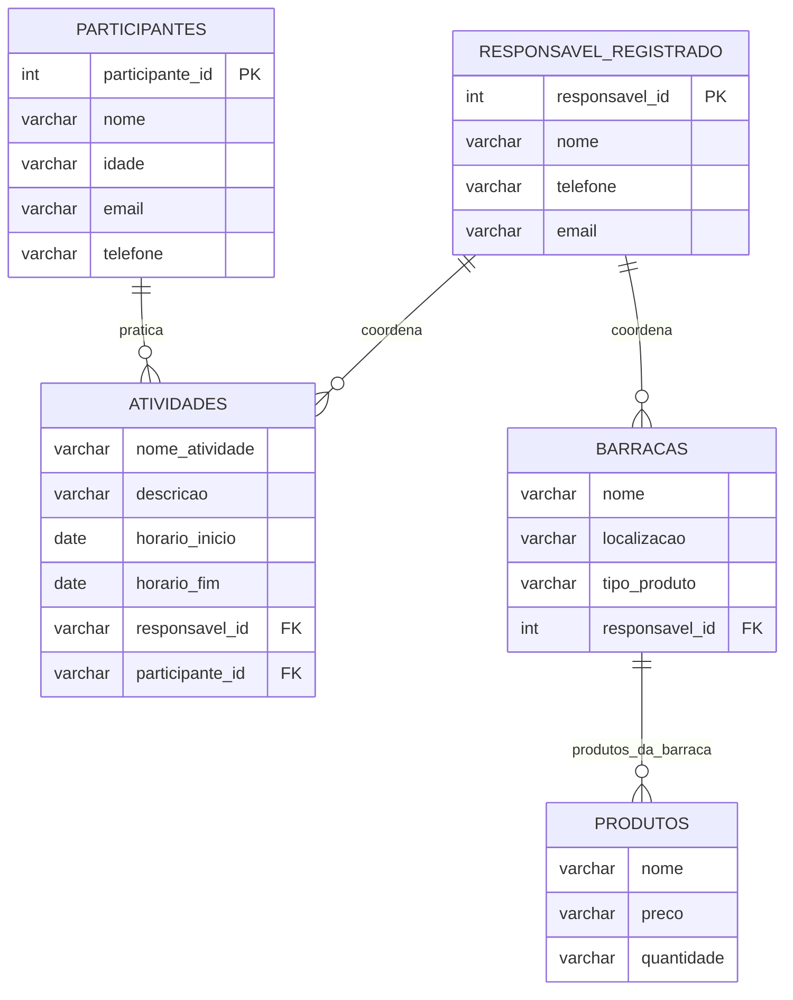

<!-- "O "Arraial do futuro" é uma grandiosa Festa Junina aberta à comunidade, que atrai um grande número de participantes e envolve diversas atividades e barracas. Para melhorar a organização e a eficiência deste evento, é necessário desenvolver um sistema de gestão de dados específico para a festa. Este sistema ajudará a coordenar as diferentes atividades, produtos, barracas e participantes, garantindo uma experiência mais fluida e agradável para todos os envolvidos.

Primeiramente, é essencial identificar as principais entidades envolvidas no sistema. Entre essas entidades, destacam-se os participantes, as barracas, os produtos, as atividades. Cada uma dessas entidades possui características e necessidades específicas que devem ser registradas e gerenciadas pelo sistema.

Os participantes da festa são as pessoas que comparecerão ao evento. Cada participante precisa se cadastrar no sistema, fornecendo informações básicas como nome completo, idade, e-mail e telefone de contato. Esses dados são fundamentais para a comunicação e o controle de acesso ao evento.

As barracas representam os pontos de venda de produtos e serviços na festa. Cada barraca deve ter um responsável registrado, que também fornecerá seus dados pessoais (nome, telefone e e-mail). Além disso, é necessário cadastrar o nome da barraca, o tipo de produto vendido (como comidas típicas, bebidas ou jogos) e sua localização específica dentro da festa, como "ao lado do palco principal".

Dentro das barracas, há uma variedade de produtos que precisam ser detalhados no sistema. Cada produto deve ser registrado com informações como nome, preço e quantidade disponível. Esse controle é vital para a gestão de estoque e para garantir que os produtos estejam disponíveis para os participantes durante toda a festa.

As atividades programadas são outra parte crucial do evento, incluindo quadrilhas, concursos e apresentações musicais. Cada atividade precisa ser registrada com um nome, uma descrição, horários de início e término, além do responsável pela atividade, que deve ser um participante já cadastrado no sistema. Esse gerenciamento permite uma coordenação eficiente e evita conflitos de horários.

Com base nessas descrições, identifiquem e descrevam detalhadamente cada uma das entidades mencionadas, definindo seus atributos específicos. Além disso, é fundamental determinar os relacionamentos entre as entidades.

A criação de um diagrama entidade-relacionamento (ER) será um passo crucial para visualizar e entender a estrutura do sistema. 

1. Identificar e descrever as entidades do sistema, incluindo participantes, barracas, produtos e atividades.
2. Definir os atributos necessários para cada entidade, garantindo um detalhamento adequado para a gestão do evento.
3. Determinar e representar os relacionamentos entre as entidades, assegurando uma compreensão clara de como os dados se interconectam.
4. Elaborar um diagrama entidade-relacionamento (ER) que represente o sistema de gestão da festa junina, facilitando a visualização das entidades e seus relacionamentos." -->

