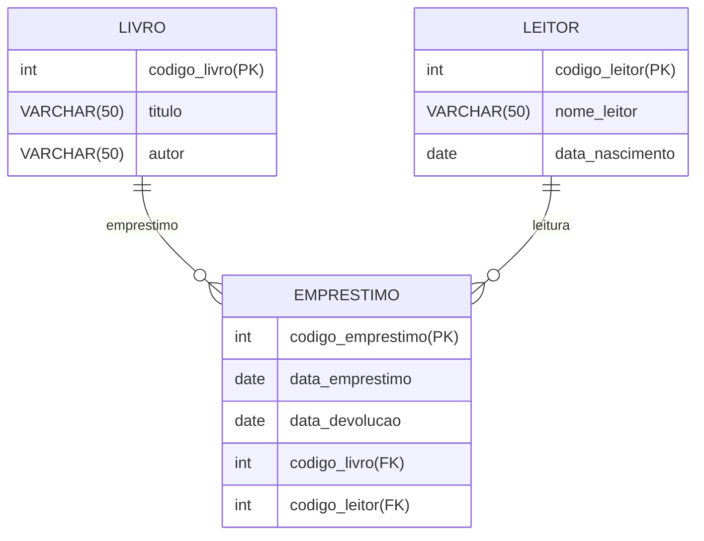

```mermaid

erDiagram
LIVRO{
    int codigo_livro(PK)
    VARCHAR(50) titulo
    VARCHAR(50) autor
}

EMPRESTIMO{
    int codigo_emprestimo(PK)
    date data_emprestimo
    date data_devolucao
    int codigo_livro(FK)
    int codigo_leitor(FK)
}

LEITOR{
    int codigo_leitor(PK)
    VARCHAR(50) nome_leitor
    date data_nascimento
}

LIVRO ||--o{ EMPRESTIMO : emprestimo
LEITOR ||--o{ EMPRESTIMO : leitura

```