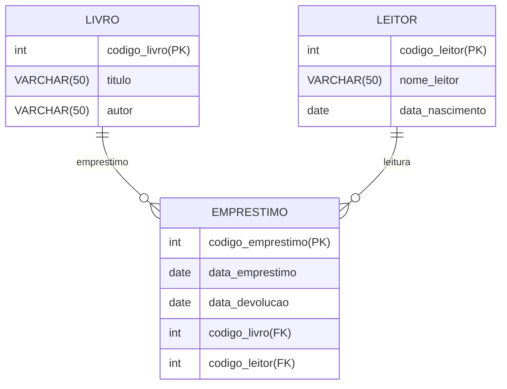

<!-- Uma biblioteca deseja organizar seu sistema de empréstimo de livros. Cada livro disponível na biblioteca possui um identificador único, chamado de Código do Livro, além de um título e um autor. Os leitores que são as pessoas que podem pegar livros emprestados, também possuem um identificador único, chamado de Código do Leitor, bem como um nome e uma data de nascimento."

Os empréstimos representam o ato de um leitor pegar um livro emprestado e possuem um identificador único, chamado de Código do Empréstimo, além de duas datas: a Data do Empréstimo e a Data de Devolução. Um leitor pode pegar emprestado vários livros ao longo do tempo, mas cada livro pode ser emprestado a apenas um leitor de cada vez. 
-->

