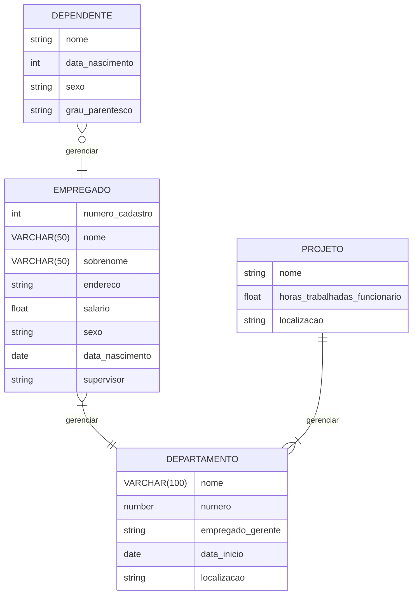

```mermaid

erDiagram
DEPARTAMENTO{
    VARCHAR(100) nome
    number numero 
    string empregado_gerente
    date data_inicio
    string localizacao 
    }
EMPREGADO {
    int numero_cadastro
    VARCHAR(50) nome
    VARCHAR(50) sobrenome
    string endereco
    float salario
    string sexo
    date data_nascimento
    string supervisor
    }
DEPENDENTE{
    string nome 
    int data_nascimento
    string sexo
    string grau_parentesco
    }
PROJETO{
    string nome
    float horas_trabalhadas_funcionario
    string localizacao
    }

    EMPREGADO }|--|| DEPARTAMENTO : gerenciar
    PROJETO ||--|{ DEPARTAMENTO : gerenciar
    DEPENDENTE }o -- || EMPREGADO : gerenciar

```
